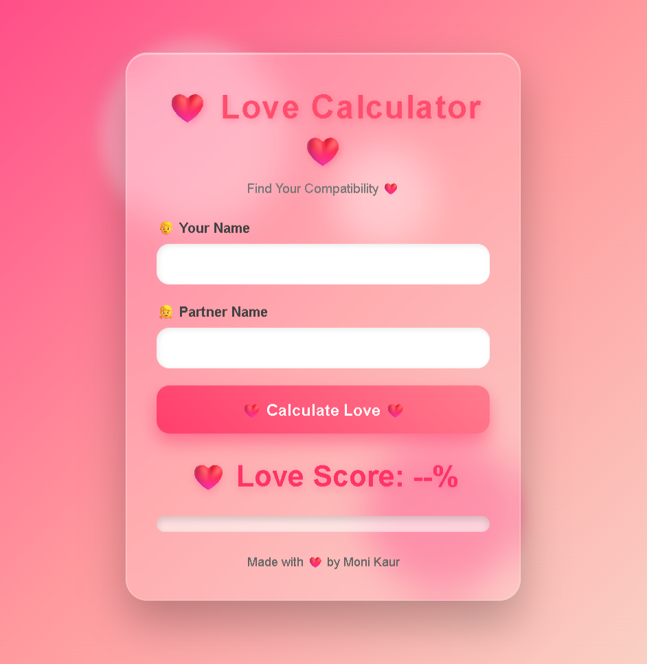

# ❤️ Love Calculator

A fun and interactive **Love Calculator** built using **HTML, CSS, and JavaScript**. Enter two names to calculate a compatibility score with smooth animations, a colorful progress bar, and a personalized message.

## 🚀 Live Demo

🌐 **GitHub Pages:**  
https://kaurmoni0013.github.io/Love-Calculator/

---

## 📸 Preview




---

## ✨ Features

- ❤️ Calculate a love compatibility score (0–100%)
- 🎯 Smooth animated score counter
- 📊 Animated progress bar
- 💌 Personalized compatibility messages
- 💖 Heart animation for high compatibility scores
- 🌈 Beautiful glassmorphism UI
- 📱 Fully responsive design
- ⚡ Built with pure HTML, CSS & JavaScript
- 🚫 Input validation for empty fields

---

## 🛠️ Technologies Used

- HTML5
- CSS3
- JavaScript (ES6)

---

## 📂 Project Structure

```
Love-Calculator/
│
├── index.html
├── style.css
├── loveCalculator.js
├── image.png
└── README.md
```

---

## ⚙️ How to Run Locally

1. Clone the repository

```bash
git clone https://github.com/kaurmoni0013/Love-Calculator.git
```

2. Open the project folder.

3. Double-click **index.html**

or

Open it using **Live Server** in VS Code.

---

## 💡 How It Works

1. Enter your name.
2. Enter your partner's name.
3. Click **Calculate Love**.
4. The app calculates a compatibility score using a custom JavaScript algorithm.
5. The score is displayed with:
   - Animated percentage counter
   - Progress bar
   - Compatibility message
   - Falling heart animation for high scores

---

## 👩‍💻 Author

**Moni Kaur**

- GitHub: https://github.com/kaurmoni0013

---

## ⭐ Support

If you enjoyed this project, please consider giving it a ⭐ on GitHub.

It motivates me to build more exciting projects!

---

## 📜 License

This project is licensed under the MIT License.